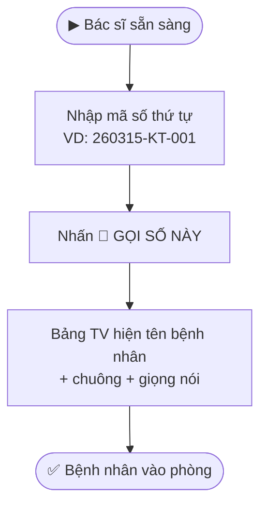

> **Quick Reference**
> - **Ai dùng**: Lễ tân · Bác sĩ · Quản trị viên
> - **Truy cập**: `/noi-bo/dat-lich-nhanh` (QR Builder) · `/noi-bo/tiep-nhan` (Gọi số)
> - **Bảo mật**: Trang nội bộ không được index bởi Google (noindex, nofollow)

---

## Module A: Dashboard Tạo Link & QR Đặt Lịch

**Truy cập:** [/noi-bo/dat-lich-nhanh](https://phusanansinh.pages.dev/noi-bo/dat-lich-nhanh)

### Chức năng 1: Tạo Link Tuỳ Chỉnh

Cho phép lễ tân tạo link đặt lịch với thông tin đã điền sẵn:

| Trường | Mô tả | Ví dụ |
|--------|-------|-------|
| Dịch vụ | Chọn sẵn dịch vụ trong link | Khám thai định kỳ |
| Nguồn (ref) | Tracking nguồn khách | `hoadon`, `letan`, `bacsi`, `quay` |
| Tên khách | Tên điền sẵn (tuỳ chọn) | Nguyễn Thị Hoa |
| SĐT | SĐT điền sẵn (tuỳ chọn) | 0901234567 |
| Ghi chú | Ghi chú sẵn (tuỳ chọn) | Tái khám sau 2 tuần |

**Kết quả:**
- Link đặt lịch tự động tạo ở ô kết quả
- Mã QR tự động sinh tương ứng
- Bấm **📋 Copy** để sao chép link
- Bấm **⬇️ Tải QR** để tải ảnh QR về máy

### Chức năng 2: Link & QR Theo Dịch Vụ

Bảng có sẵn tất cả link và QR cho 7 dịch vụ + 1 link chung:

| Cột | Mô tả |
|-----|-------|
| **Dịch vụ** | Tên + mô tả ngắn |
| **Link** | Đường dẫn ngắn (ví dụ: `/dat-lich?dv=kham-thai`) |
| **Copy** | Nút copy link thường / copy link hoá đơn (có `&ref=hoadon`) |
| **QR** | Mã QR tương ứng |

<strong>Quy trình lễ tân hàng ngày</strong> 
1. Mở trang `/noi-bo/dat-lich-nhanh`
2. Khi khách cần tái khám: Copy link dịch vụ phù hợp → gửi qua Zalo/tin nhắn
3. Khi in hoá đơn: Dùng nút **📄 Hoá đơn** (link có `ref=hoadon`)

### Chức năng 3: QR Lấy Số Thứ Tự

Mã QR dẫn đến trang `/lay-so-thu-tu` — in và dán tại quầy lễ tân để khách tự quét.

### Chức năng 4: In QR

Bấm **"In trang này"** để in các thẻ QR. Cắt ra và dán lên:
- Hoá đơn thanh toán
- Quầy lễ tân
- Tường phòng chờ
- Tờ rơi

---

## Module B: Điều Phối Gọi Số {#dieu-phoi-goi-so}

**Truy cập:** [/noi-bo/tiep-nhan](https://phusanansinh.pages.dev/noi-bo/tiep-nhan)

### Đăng nhập

1. Chọn **phòng khám** (danh sách tải từ API)
2. Nhập **mật khẩu token** (cấp bởi quản trị viên)
3. Nhấn **"Truy Cập"**
4. Hệ thống lưu phiên đăng nhập (tự nhớ đến khi nhấn Thoát)

### Gọi số bệnh nhân

> **Mô tả:** Bác sĩ nhập mã số → nhấn gọi → bảng TV tự cập nhật hiển thị tên + phát chuông + giọng nói gọi tên.

**Các thao tác:**

| Nút | Chức năng |
|-----|----------|
| **🔔 GỌI SỐ NÀY** | Gọi bệnh nhân theo mã số đã nhập |
| **✅ KẾT THÚC / DỌN TRỐNG** | Xoá trạng thái phòng hiện tại (sau khi khám xong) |
| **Thoát** | Đăng xuất khỏi hệ thống |

### Định dạng mã số

Nhập đúng format: `YYMMDD-XX-NNN`

Ví dụ: `260315-KT-001` = Ngày 15/03/2026, Khám thai, bệnh nhân số 1

---

## Xử Lý Sự Cố

🔴 Lỗi "Token sai hoặc hết hạn"

**Nguyên nhân:** Mật khẩu token không đúng hoặc đã bị đổi.

**Cách xử lý:**
1. Liên hệ quản trị viên để lấy token mới
2. Nhấn **Thoát** rồi đăng nhập lại

🔴 Danh sách phòng hiện "Đang tải..."

**Nguyên nhân:** Không kết nối được API.

**Cách xử lý:**
1. Kiểm tra WiFi
2. Tải lại trang (F5)

🔴 Bấm gọi số nhưng bảng TV không cập nhật

**Cách xử lý:**
1. Kiểm tra bảng TV có đang chạy không
2. Đợi 3-5 giây (bảng TV poll mỗi 3 giây)
3. Kiểm tra cả 2 thiết bị cùng kết nối internet

---

## Liên quan

- [Bảng số TV](./bang-so-tv)
- [Quản lý số thứ tự](./quan-ly-so-thu-tu)
- [Vai trò & trách nhiệm](./vai-tro-trach-nhiem)
