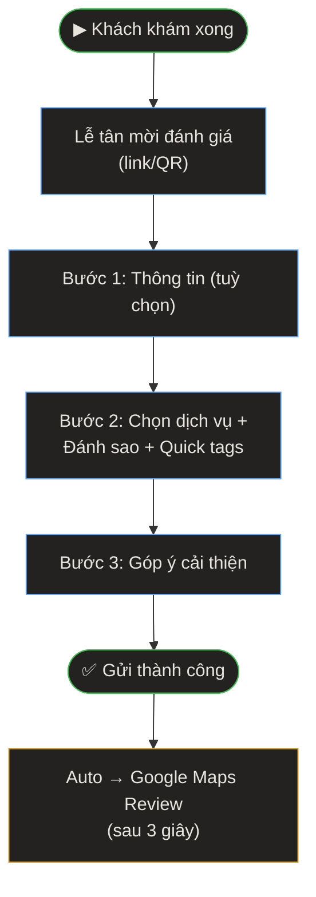

> **Quick Reference**
> - **Ai dùng**: Khách hàng (đánh giá) · Lễ tân (mời đánh giá)
> - **Truy cập**: [/danh-gia-dich-vu](https://phusanansinh.pages.dev/danh-gia-dich-vu)
> - **Thời gian**: ~1-2 phút
> - **Kết quả**: Feedback ghi vào Sheets + tự chuyển sang Google Maps Review

---

## Quy Trình

> **Mô tả:** Khách khám xong → lễ tân mời đánh giá → form 3 bước → gửi → tự động chuyển sang Google Maps Review.

---

## Hướng Dẫn Chi Tiết

### Bước 1: Thông tin nhân (Tuỳ chọn)

| Trường | Bắt buộc | Mô tả |
|--------|----------|-------|
| Họ và tên | ❌ | Có thể để trống cho ẩn danh |
| Số điện thoại | ❌ | Để PK hỗ trợ nếu cần |

### Bước 2: Đánh giá dịch vụ

1. **Chọn dịch vụ đã sử dụng** ✅ (bắt buộc) — 6 chip lựa chọn:
   - 🤰 Khám thai · 🌸 Phụ khoa · 👔 Nam khoa · 👶 Siêu âm 5D · ☀️ Điều trị vô sinh · 🛡️ Tránh thai

2. **Đánh sao (1-5)** ✅ (bắt buộc):
   - ⭐⭐⭐⭐⭐ Rất hài lòng
   - ⭐⭐⭐⭐ Hài lòng
   - ⭐⭐⭐ Bình thường
   - ⭐⭐ Chưa hài lòng
   - ⭐ Rất kém

3. **Quick tags** (tuỳ chọn) — chọn nhanh: "Bác sĩ tận tâm", "Dịch vụ nhanh", "Máy móc hiện đại", "Giải thích rõ ràng", "Sạch sẽ, thoáng mát", "Đúng lịch hẹn", "Chi phí hợp lý", "Nhân viên nhiệt tình"

4. **Chia sẻ chi tiết** (tuỳ chọn) — viết thêm nhận xét

### Bước 3: Góp ý cải thiện

Khách có thể đề xuất PK cải thiện điều gì. Trường này tuỳ chọn.

### Bước 4: Gửi & Chuyển hướng

1. Nhấn **"GỬI ĐÁNH GIÁ NGAY"**
2. Hiện màn hình cảm ơn
3. **Sau 3 giây**: Tự động chuyển sang **Google Maps Review** của PK An Sinh
4. Nếu không tự chuyển: Nhấn link bên dưới

<strong>Dành cho Lễ tân</strong> 
Mời khách đánh giá ngay sau khám. Có thể gửi link `/danh-gia-dich-vu` qua tin nhắn hoặc cho quét QR. Feedback tốt sẽ tự động kéo khách review trên Google Maps — tăng uy tín online.

---

## Luồng Dữ Liệu

| Bước | Đích | Dữ liệu |
|------|------|---------|
| Gửi form | Google Sheets | Tên, SĐT, dịch vụ, sao, tags, review, góp ý |
| Auto redirect | Google Maps | Khách tự viết review trên Maps |

---

## Xử Lý Sự Cố

🔴 Nút "GỬI ĐÁNH GIÁ" bị mờ / không nhấn được

**Nguyên nhân:** Chưa chọn đủ 2 trường bắt buộc (dịch vụ + đánh sao).

**Cách xử lý:**
1. Chọn dịch vụ đã sử dụng
2. Nhấn vào sao đánh giá (1-5 sao)
3. Nút sẽ tự kích hoạt

🔴 Không tự chuyển sang Google Maps

**Cách xử lý:** Nhấn link **"Bấm vào đây nếu không tự chuyển"** hiển thị bên dưới.

---

## Liên quan

- [Đặt lịch khám](./dat-lich-kham)
- [Vai trò Lễ tân — Mời đánh giá](./vai-tro-trach-nhiem#le-tan)
- [Tổng quan hệ thống](./index)
