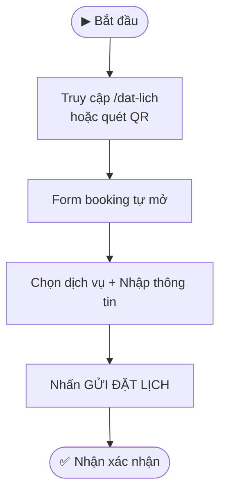

> **Quick Reference**
> - **Ai dùng**: Khách hàng (tự đặt) · Lễ tân (đặt hộ)
> - **Truy cập**: [/dat-lich](https://phusanansinh.pages.dev/dat-lich) hoặc quét QR
> - **Thời gian**: ~1 phút
> - **Kết quả**: Lịch hẹn được ghi nhận vào Google Sheets

---

## Quy Trình Tổng Quan



> **Mô tả:** Khách hàng truy cập trang đặt lịch → form tự động mở → điền thông tin → gửi → nhận xác nhận.

---

## Hướng Dẫn Chi Tiết

### Bước 1: Truy cập trang đặt lịch

**Cách 1 — Trực tiếp:** Vào link `phusanansinh.pages.dev/dat-lich`

**Cách 2 — Quét QR:** Quét mã QR được dán tại quầy lễ tân, hoá đơn, hoặc do bác sĩ/lễ tân cung cấp.

**Cách 3 — Link có sẵn dịch vụ:** Lễ tân có thể gửi link đã chọn sẵn dịch vụ cho khách:

| Dịch vụ | Link |
|---------|------|
| Khám thai | `/dat-lich?dv=kham-thai` |
| Siêu âm 5D | `/dat-lich?dv=sieu-am-5d` |
| Khám phụ khoa | `/dat-lich?dv=kham-phu-khoa` |
| Khám nam khoa | `/dat-lich?dv=kham-nam-khoa` |
| Điều trị vô sinh | `/dat-lich?dv=vo-sinh` |
| Tư vấn tránh thai | `/dat-lich?dv=tranh-thai` |
| Tư vấn chung | `/dat-lich?dv=tu-van` |

<div class=\"admonition\"><strong>💡 Mẹo:</strong><br/>
Thêm `&ref=letan` hoặc `&ref=hoadon` vào cuối link để tracking nguồn khách hàng. Ví dụ: `/dat-lich?dv=kham-thai&ref=hoadon`
</div>

### Bước 2: Điền thông tin đặt lịch

Form booking bao gồm các trường sau:

| Trường | Bắt buộc | Mô tả | Ví dụ |
|--------|----------|-------|-------|
| Họ và tên | ✅ | Họ tên đầy đủ bệnh nhân | Nguyễn Thị Mai |
| Số điện thoại | ✅ | SĐT 9-11 chữ số, bắt đầu bằng 0 | 0901234567 |
| Dịch vụ khám | ✅ | Chọn 1 trong 7 dịch vụ | Khám thai định kỳ |
| Ngày khám | ❌ | Ngày mong muốn (tuỳ chọn) | 20/03/2026 |
| Khung giờ | ❌ | Chọn khung giờ (tuỳ chọn) | 18:00 – 19:00 |
| Ghi chú | ❌ | Thông tin bổ sung | Tái khám thai 20 tuần |

### Bước 3: Gửi & nhận xác nhận

1. Nhấn nút **"GỬI ĐẶT LỊCH"**
2. Hệ thống tự động gửi dữ liệu tới Google Sheets
3. Hiện thông báo **"Đặt lịch thành công!"**
4. Lễ tân sẽ nhận được thông tin và liên hệ xác nhận nếu cần

---

## Các Tham Số URL (Dành cho Lễ tân / Kỹ thuật)

Hệ thống hỗ trợ gửi thông tin qua URL params để tự động điền sẵn form:

| Param | Alias | Mô tả | Ví dụ |
|-------|-------|-------|-------|
| `dv` | `service` | Mã dịch vụ (slug) | `kham-thai` |
| `ten` | `name` | Họ tên khách | `Nguyen+Thi+Hoa` |
| `sdt` | `phone` | Số điện thoại | `0901234567` |
| `ghi-chu` | `note` | Ghi chú | `Tai+kham+tuan+20` |
| `ref` | `source` | Nguồn tracking | `hoadon`, `letan`, `crm` |
| `ngay` | `date` | Ngày khám (ISO) | `2026-03-20` |
| `gio` | `time` | Khung giờ | `18:00-19:00` |

**Ví dụ link đầy đủ cho CRM gửi SMS:**
```
/dat-lich?dv=kham-thai&ten=Nguyen+Thi+Hoa&sdt=0901234567&ghi-chu=Tai+kham+tuan+20&ref=crm
```

---

## Xử Lý Sự Cố

<details>
<summary>🔴 Lỗi "Số điện thoại không hợp lệ"</summary>

**Nguyên nhân:** SĐT không đúng định dạng (phải bắt đầu bằng 0, từ 9-11 chữ số).

**Cách xử lý:**
1. Kiểm tra lại SĐT, xoá khoảng trắng
2. Đảm bảo bắt đầu bằng số 0
3. Đảm bảo 9-11 chữ số

</details>

<details>
<summary>🔴 Form không mở tự động</summary>

**Nguyên nhân:** JavaScript bị chặn hoặc mạng chậm.

**Cách xử lý:**
1. Nhấn nút **"Mở Form Đặt Lịch"** hiển thị bên dưới
2. Kiểm tra kết nối internet
3. Thử F5 tải lại trang

</details>

---

## FAQ

<details>
<summary>Q: Đặt lịch xong có nhận tin nhắn xác nhận không?</summary>

**A:** Tuỳ vào cấu hình eSMS. Nếu đã kích hoạt, hệ thống sẽ gửi SMS xác nhận tự động. Nếu chưa, lễ tân sẽ liên hệ qua điện thoại.

</details>

<details>
<summary>Q: Khách có thể đặt lịch cho người khác không?</summary>

**A:** Có. Chỉ cần điền tên và SĐT của người cần khám. Trong mục ghi chú có thể ghi "Đặt hộ cho..."

</details>

---

## Liên quan

- [Công cụ nội bộ — Tạo QR & Link đặt lịch](./cong-cu-noi-bo)
- [Vai trò Lễ tân](./vai-tro-trach-nhiem#le-tan)
- [Tổng quan hệ thống](./index)
