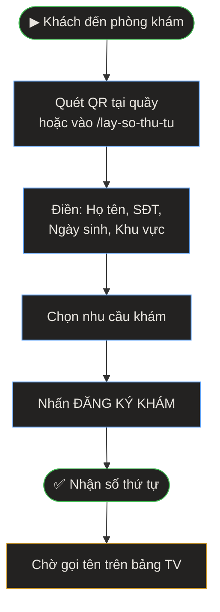

> **Quick Reference**
> - **Ai dùng**: Khách hàng (đăng ký) · Lễ tân (hỗ trợ)
> - **Truy cập**: [/lay-so-thu-tu](https://phusanansinh.pages.dev/lay-so-thu-tu) hoặc quét QR
> - **Thời gian**: ~30 giây
> - **Kết quả**: Nhận số thứ tự dạng `YYMMDD-XX-NNN`

---

## Quy Trình Đăng Ký Số

> **Mô tả:** Khách quét QR hoặc vào trang web → điền thông tin → chọn dịch vụ → nhấn đăng ký → nhận số thứ tự → chờ gọi tên.

---

## Hướng Dẫn Chi Tiết

### Bước 1: Truy cập trang lấy số

- **Tại phòng khám:** Quét mã QR dán tại quầy lễ tân
- **Online:** Vào link `phusanansinh.pages.dev/lay-so-thu-tu`

<strong>💡 Mẹo:</strong> 
Mã QR lấy số được in tại trang [Công cụ nội bộ](./cong-cu-noi-bo). Lễ tân cần đảm bảo QR luôn được dán rõ ràng tại quầy.

### Bước 2: Điền thông tin

| Trường | Bắt buộc | Mô tả | Ví dụ |
|--------|----------|-------|-------|
| Họ và tên | ✅ | Họ tên đầy đủ | Nguyễn Thị Mai |
| Số điện thoại | ✅ | 9-11 chữ số, bắt đầu bằng 0 | 0901234567 |
| Ngày sinh | ❌ | Ngày/tháng/năm sinh | 15/06/1990 |
| Giới tính | ❌ | Mặc định: Nữ | Nữ / Nam |
| Khu vực | ❌ | Phường/xã (autocomplete) | Đồng Nguyên |
| Nhu cầu khám | ✅ | Chọn 1 trong 7 dịch vụ | Khám thai định kỳ |
| Ghi chú | ❌ | Thông tin bổ sung | Tái khám, thai 20 tuần |

<strong>💡 Mẹo:</strong> 
Hệ thống **tự động nhớ** thông tin khách qua localStorage. Lần sau quay lại, form sẽ được điền sẵn — rất nhanh cho khách tái khám.

### Bước 3: Nhấn "ĐĂNG KÝ KHÁM"

1. Nhấn nút **🏥 ĐĂNG KÝ KHÁM** ở cuối trang
2. Hệ thống gửi thông tin tới Google Sheets
3. Nhận **số thứ tự** hiển thị trên màn hình

### Bước 4: Hiểu số thứ tự

Số thứ tự có cấu trúc: **`YYMMDD-XX-NNN`**

| Phần | Ý nghĩa | Ví dụ |
|------|---------|-------|
| `YYMMDD` | Ngày đăng ký (năm/tháng/ngày) | `260315` = 15/03/2026 |
| `XX` | Mã dịch vụ (2 ký tự) | `KT` = Khám thai |
| `NNN` | Số thứ tự trong ngày | `001`, `002`, ... |

**Bảng mã dịch vụ:**

| Mã | Dịch vụ |
|----|---------|
| `KT` | Khám thai định kỳ |
| `SA` | Siêu âm 5D |
| `PK` | Khám phụ khoa |
| `NK` | Khám nam khoa |
| `HM` | Điều trị vô sinh |
| `TT` | Tư vấn tránh thai |
| `CH` | Tư vấn chung |

**Ví dụ:** `260315-KT-003` = Ngày 15/03/2026, Khám thai, số thứ tự 3.

### Bước 5: Chờ gọi tên

- Ngồi chờ tại phòng khám
- Theo dõi **bảng số TV** treo tại phòng chờ
- Khi tên được gọi, vào phòng khám theo chỉ dẫn

---

## Xử Lý Sự Cố

🔴 Lỗi "Số điện thoại không hợp lệ"

**Nguyên nhân:** SĐT không bắt đầu bằng 0 hoặc không đủ 9-11 chữ số.

**Cách xử lý:**
1. Xoá khoảng trắng trong SĐT
2. Kiểm tra bắt đầu bằng số 0
3. Đếm lại số chữ số (phải 9-11)

🔴 Không nhận được số thứ tự

**Nguyên nhân:** Mạng yếu hoặc Google Sheets không phản hồi.

**Cách xử lý:**
1. Kiểm tra kết nối internet (WiFi phòng khám)
2. Thử lại sau 30 giây
3. Nếu vẫn lỗi: Lễ tân đăng ký hộ trên máy tính

🔴 Muốn đăng ký cho nhiều người

**Cách xử lý:**
Sau khi đăng ký xong, nhấn nút **"Đăng ký thêm người khác"** ở cuối trang. Form sẽ reset nhưng giữ lại thông tin cơ bản.

---

## FAQ

Q: Số thứ tự có hết hạn không?

**A:** Số thứ tự chỉ có hiệu lực trong ngày đăng ký (theo mã YYMMDD).

Q: Có thể đăng ký trước từ nhà không?

**A:** Được. Khách có thể vào link `/lay-so-thu-tu` từ nhà, nhưng nên đăng ký khi đã đến hoặc gần đến phòng khám để tránh mất lượt.

---

## Liên quan

- [Bảng số TV — Hiển thị phòng chờ](./bang-so-tv)
- [Công cụ nội bộ — Điều phối gọi số](./cong-cu-noi-bo#dieu-phoi-goi-so)
- [Tổng quan hệ thống](./index)
