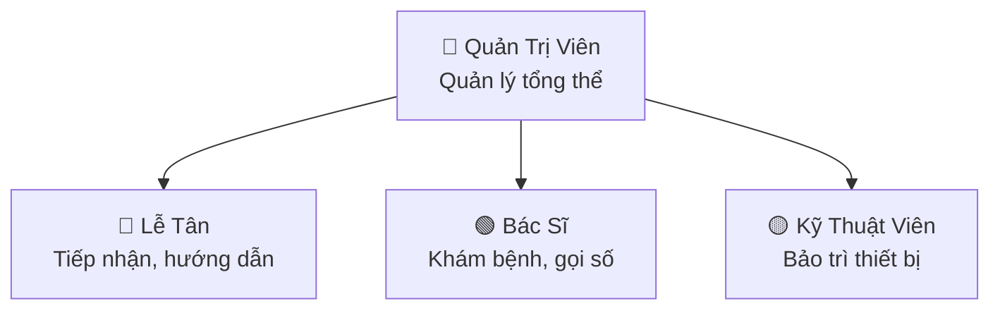
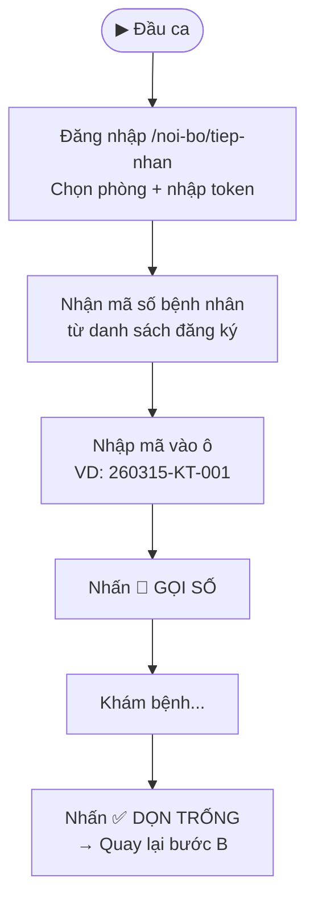

> **Quick Reference**
> - **Cập nhật**: 15/03/2026
> - **Phạm vi**: Toàn bộ nhân sự phòng khám sử dụng hệ thống website
> - **Nguyên tắc**: Mỗi vị trí cần đọc đúng phần của mình và thực hiện đủ các nhiệm vụ hàng ngày

---

## Tổng Quan Vai Trò

> **Mô tả:** Quản trị viên quản lý toàn hệ thống. Lễ tân tiếp nhận + hướng dẫn khách. Bác sĩ khám bệnh + gọi số. Kỹ thuật viên bảo trì TV + thiết bị.

---

## 👩‍💼 Lễ Tân {#le-tan}

### Nhiệm vụ hàng ngày

| # | Nhiệm vụ | Khi nào | Làm thế nào | Tài liệu |
|---|----------|---------|-------------|----------|
| 1 | **Mở bảng số TV** | Đầu ca (17:00) | Bật TV → mở `/bang-so` → fullscreen | [Bảng số TV](./bang-so-tv) |
| 2 | **Hướng dẫn khách lấy số** | Khi khách đến | Chỉ QR ở quầy hoặc hỗ trợ đăng ký trên máy | [Số thứ tự](./quan-ly-so-thu-tu) |
| 3 | **Gửi link đặt lịch tái khám** | Sau khi khách khám xong | Mở `/noi-bo/dat-lich-nhanh` → copy link phù hợp → gửi Zalo | [Công cụ nội bộ](./cong-cu-noi-bo) |
| 4 | **In QR cho hoá đơn** | Khi in hoá đơn | Dùng nút **📄 Hoá đơn** tại dashboard nội bộ | [Công cụ nội bộ](./cong-cu-noi-bo) |
| 5 | **Mời khách đánh giá** | Sau khi khách thanh toán | Gửi link `/danh-gia-dich-vu` hoặc QR đánh giá | [Đánh giá dịch vụ](./danh-gia-dich-vu) |
| 6 | **Tắt bảng số TV** | Cuối ca (21:00) | Tắt TV và thiết bị | [Bảng số TV](./bang-so-tv) |

### Checklist Mở Cửa (17:00)

- [ ] Bật TV phòng chờ → mở `/bang-so` → fullscreen
- [ ] Kiểm tra QR lấy số dán tại quầy (còn nguyên, không rách)
- [ ] Kiểm tra máy tính/tablet lễ tân kết nối WiFi
- [ ] Mở sẵn tab `/noi-bo/dat-lich-nhanh` trên máy tính

### Checklist Đóng Cửa (21:00)

- [ ] Tắt TV phòng chờ + thiết bị
- [ ] Báo cáo sự cố (nếu có) cho quản trị viên

### Kỹ năng cần thiết

| Kỹ năng | Mức độ | Ghi chú |
|---------|--------|---------|
| Sử dụng trình duyệt web | 🟢 Cơ bản | Copy/paste link, mở tab |
| Copy link & gửi Zalo | 🟢 Cơ bản | Nhấn nút Copy → dán vào Zalo |
| Hướng dẫn quét QR | 🟢 Cơ bản | Mở camera điện thoại → quét |
| Xử lý sự cố cơ bản | 🟡 Trung bình | Tải lại trang, kiểm tra WiFi |

---

## 👩‍⚕️ Bác Sĩ {#bac-si}

### Nhiệm vụ hàng ngày

| # | Nhiệm vụ | Khi nào | Làm thế nào | Tài liệu |
|---|----------|---------|-------------|----------|
| 1 | **Đăng nhập hệ thống gọi số** | Đầu ca | Mở `/noi-bo/tiep-nhan` → chọn phòng → nhập token | [Điều phối gọi số](./cong-cu-noi-bo#dieu-phoi-goi-so) |
| 2 | **Gọi bệnh nhân tiếp theo** | Trước mỗi lượt khám | Nhập mã số → nhấn **🔔 GỌI SỐ NÀY** | [Điều phối gọi số](./cong-cu-noi-bo#dieu-phoi-goi-so) |
| 3 | **Dọn trống sau lượt khám** | Sau mỗi lượt khám | Nhấn **✅ KẾT THÚC / DỌN TRỐNG** | [Điều phối gọi số](./cong-cu-noi-bo#dieu-phoi-goi-so) |
| 4 | **Sử dụng công cụ lâm sàng** | Trong quá trình khám | Mở công cụ phù hợp → nhập số liệu → đọc kết quả | [Công cụ lâm sàng](./cong-cu-lam-sang) |
| 5 | **Dặn dò tái khám** | Cuối lượt khám | Lễ tân sẽ gửi link đặt lịch cho bệnh nhân | [Đặt lịch](./dat-lich-kham) |
| 6 | **Đăng xuất cuối ca** | Cuối ca | Nhấn nút **Thoát** trên hệ thống gọi số | — |

### Quy trình Gọi Số Chi Tiết

> **Mô tả:** Đầu ca đăng nhập → nhận mã → gọi số → khám → dọn trống → lặp lại cho bệnh nhân tiếp.

### Bảng Công Cụ Lâm Sàng Theo Tình Huống

| Tình huống lâm sàng | Công cụ sử dụng | Đường dẫn |
|---------------------|-----------------|-----------|
| Khám thai lần đầu | Tính ngày dự sinh | `/cong-cu/tinh-ngay-du-sinh` |
| Thai phụ muốn biết cân nặng em bé | Cân nặng thai nhi | `/can-nang-thai-nhi` |
| Siêu âm Doppler | Phân tích Doppler | `/cong-cu/doppler-thai-nhi` |
| Đánh giá trước khởi phát chuyển dạ | Bishop Score | `/cong-cu/bishop-score` |
| Sàng lọc GDM | Đái tháo đường thai kỳ | `/cong-cu/du-doan-dai-thao-duong-thai-ky` |
| Nguy cơ tiền sản giật | Sàng lọc TSG | `/cong-cu/sang-loc-tien-san-giat` |
| Nghi ngờ khối u buồng trứng | Đánh giá khối u | `/cong-cu/danh-gia-khoi-u-buong-trung` |
| Đánh giá nguy cơ sinh non | Dự đoán sinh non | `/cong-cu/du-doan-sinh-non` |

---

## 👨‍💻 Quản Trị Viên {#quan-tri-vien}

### Nhiệm vụ

| # | Nhiệm vụ | Tần suất | Làm thế nào |
|---|----------|----------|-------------|
| 1 | **Quản lý token truy cập** | Khi cần | Cấp/đổi token cho bác sĩ đăng nhập hệ thống gọi số |
| 2 | **Cấu hình phòng khám** | Khi thay đổi phòng/BS | Cập nhật danh sách phòng + tên bác sĩ qua API Config |
| 3 | **Kiểm tra Google Sheets** | Hàng ngày | Xem dữ liệu đặt lịch, số thứ tự, feedback |
| 4 | **Giám sát sự cố** | Liên tục | Nhận báo cáo từ lễ tân/BS, xử lý lỗi kỹ thuật |
| 5 | **Deploy cập nhật** | Khi có thay đổi | `npm run deploy` (test → build → deploy Cloudflare) |
| 6 | **Quản lý Workers** | Khi cần | Cấu hình API worker và queue-proxy trên Cloudflare |
| 7 | **Đào tạo nhân sự mới** | Khi có người mới | Hướng dẫn đọc tài liệu SOP tương ứng với vai trò |
| 8 | **Kiểm tra SEO & Tracking** | Hàng tuần | Review Google Search Console, Analytics |

### Thông Tin Kỹ Thuật

| Thông tin | Giá trị |
|-----------|---------|
| **Deploy command** | `npm run deploy` |
| **API Base** | `https://sale.todyai.io/api/` |
| **Queue API endpoints** | `/queue/config`, `/queue/current`, `/queue/next` |
| **Google Sheets** | Xem Apps Script tại `docs/apps-script-so-thu-tu.js` |
| **Cloudflare Dashboard** | Workers & Pages trên Cloudflare |

---

## 📺 Kỹ Thuật Viên {#ky-thuat-vien}

### Nhiệm vụ

| # | Nhiệm vụ | Tần suất | Làm thế nào |
|---|----------|----------|-------------|
| 1 | **Cài đặt bảng số TV** | Lần đầu | Kết nối TV Box + WiFi → mở `/bang-so` → fullscreen |
| 2 | **Bảo trì TV** | Hàng tuần | Kiểm tra kết nối, restart thiết bị nếu lag |
| 3 | **In QR** | Khi cần | In từ `/noi-bo/dat-lich-nhanh` → cắt dán |
| 4 | **Xử lý sự cố WiFi** | Khi có lỗi | Restart router, kiểm tra băng thông |

---

## 📅 Lịch Trình Vận Hành Hàng Ngày

```mermaid
gantt
    title Lịch trình vận hành hàng ngày — PK An Sinh
    dateFormat HH:mm
    axisFormat %H:%M

    section Lễ Tân
    Mở TV + checklist mở cửa    :lt1, 16:45, 15min
    Hướng dẫn khách + vận hành  :lt2, 17:00, 240min
    Mời đánh giá + gửi link    :lt3, after lt2, 0min
    Checklist đóng cửa          :lt4, 21:00, 15min

    section Bác Sĩ
    Đăng nhập gọi số            :bs1, 17:00, 5min
    Khám bệnh + gọi số         :bs2, 17:05, 235min
    Đăng xuất                   :bs3, 21:00, 5min
```

> **Mô tả:** Lễ tân mở cửa 16:45, vận hành 17:00-21:00, đóng cửa 21:15. Bác sĩ đăng nhập 17:00, khám đến 21:00.

---

## ⚠️ Quy Tắc Chung

1. **Không chia sẻ token bác sĩ** cho người ngoài
2. **Luôn kiểm tra WiFi** trước khi bắt đầu ca
3. **Báo cáo sự cố** ngay cho quản trị viên qua Zalo nhóm
4. **Không tự ý sửa code/cấu hình** — liên hệ quản trị viên
5. **Đọc kỹ SOP** trước khi vận hành lần đầu

---

## Liên quan

- [Tổng quan hệ thống](./index)
- [Đặt lịch khám](./dat-lich-kham)
- [Số thứ tự](./quan-ly-so-thu-tu)
- [Bảng số TV](./bang-so-tv)
- [Công cụ nội bộ](./cong-cu-noi-bo)
- [Công cụ lâm sàng](./cong-cu-lam-sang)
